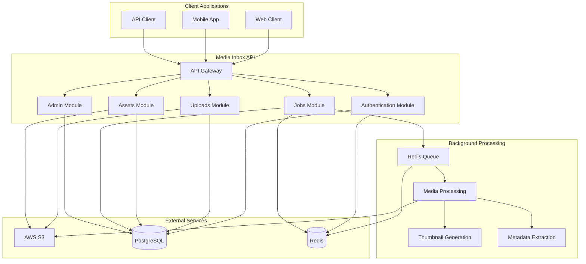
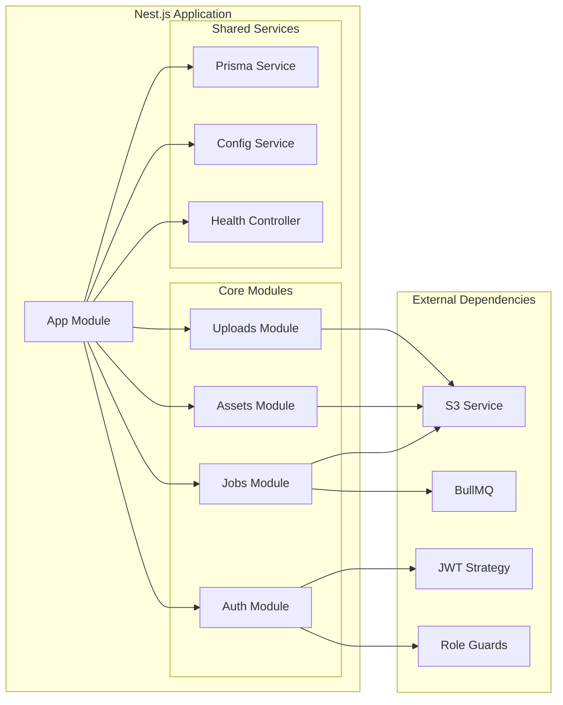
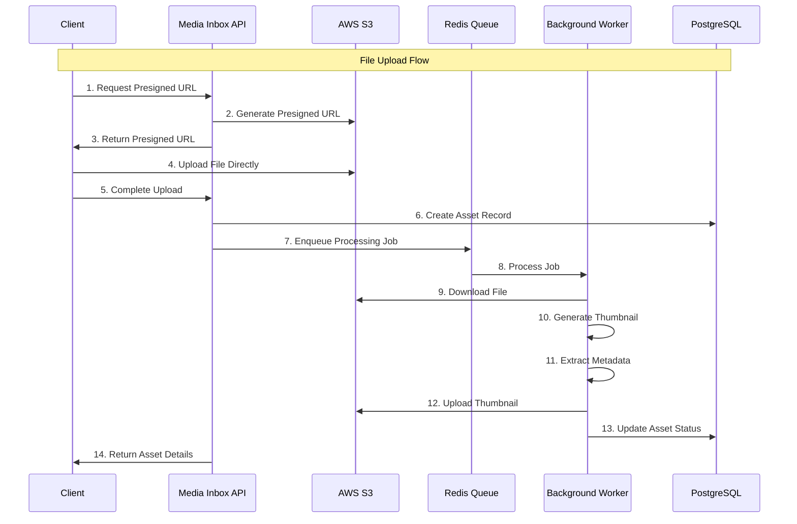
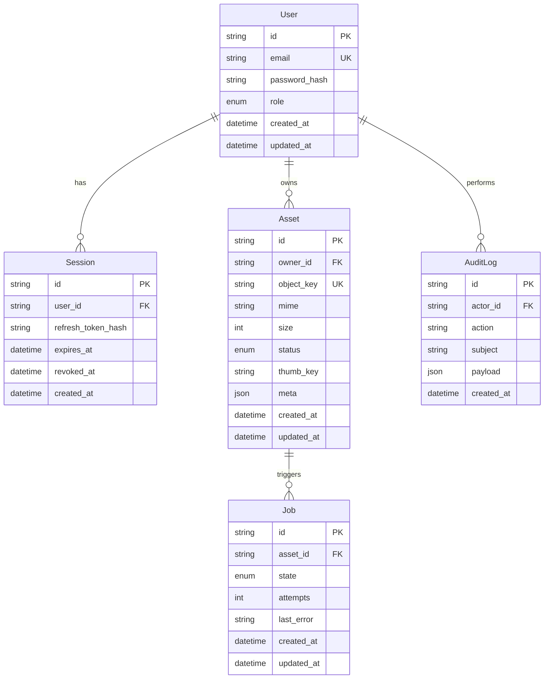
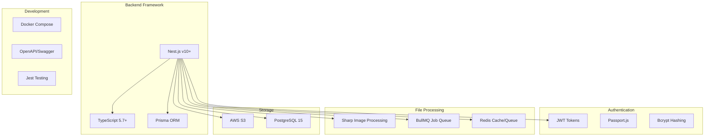
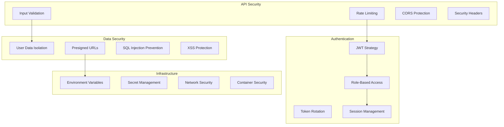
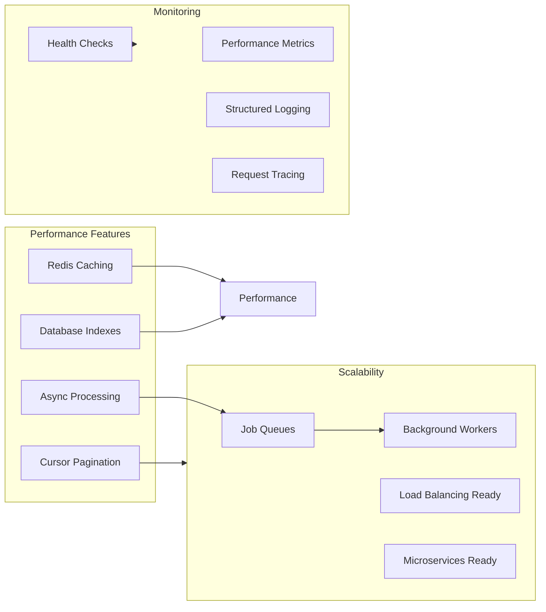

# Media Inbox - File Upload Service

A production-ready Media Inbox backend system with async file processing pipeline built with Nest.js, Redis, BullMQ, and AWS S3.

## Features

- 🔐 **Authentication & Authorization**: JWT + refresh tokens with role-based access control
- 📤 **Secure File Uploads**: Pre-signed S3 URLs for direct uploads
- ⚡ **Async Processing**: Background job processing with thumbnail generation
- 🗄️ **Asset Management**: Complete CRUD operations with pagination
- 👑 **Admin Controls**: Job monitoring and management
- 🐳 **Docker Ready**: Complete development environment
- 📚 **API Documentation**: OpenAPI/Swagger at `/docs`

## Prerequisites

- Docker and Docker Compose
- Node.js 18+ and npm
- AWS S3 bucket and credentials

## Quick Start

### 1. Clone and Setup

```bash
git clone <repository-url>
cd file-uploader
npm install
```

### 2. Configure AWS S3

Create a `.env` file based on `env.example`:

```bash
# AWS S3 Configuration
S3_ACCESS_KEY="your-aws-access-key"
S3_SECRET_KEY="your-aws-secret-key"
S3_BUCKET="your-s3-bucket-name"
S3_REGION="ap-south-1"

# Other configurations...
```

**Important**:

- Ensure your AWS credentials have S3 permissions
- Create the S3 bucket before running the application
- The bucket should be in the region specified in `S3_REGION`

### 3. Start Services

```bash
# Start PostgreSQL and Redis
docker compose up -d postgres redis

# Run database migrations
npm run db:migrate

# Seed the database
npm run db:seed

# Start the application
npm run start:dev
```

### 4. Access the Application

- **API**: http://localhost:3000
- **Swagger Docs**: http://localhost:3000/docs
- **Health Check**: http://localhost:3000/health

## Environment Variables

| Variable             | Description                  | Default      |
| -------------------- | ---------------------------- | ------------ |
| `S3_ACCESS_KEY`      | AWS Access Key ID            | Required     |
| `S3_SECRET_KEY`      | AWS Secret Access Key        | Required     |
| `S3_BUCKET`          | S3 Bucket Name               | Required     |
| `S3_REGION`          | AWS Region                   | `ap-south-1` |
| `DATABASE_URL`       | PostgreSQL connection string | Required     |
| `REDIS_URL`          | Redis connection string      | Required     |
| `JWT_SECRET`         | JWT signing secret           | Required     |
| `JWT_REFRESH_SECRET` | JWT refresh secret           | Required     |

## API Endpoints

### Authentication

- `POST /auth/register` - User registration
- `POST /auth/login` - User login
- `POST /auth/refresh` - Token refresh

### File Uploads

- `POST /uploads/presign` - Generate presigned upload URL
- `POST /uploads/complete` - Complete file upload

### Assets

- `GET /assets` - List user assets (with pagination)
- `GET /assets/:id` - Get asset details
- `DELETE /assets/:id` - Delete asset

### Admin (Admin role required)

- `GET /jobs/stats` - Queue statistics
- `GET /jobs/:id` - Job status
- `POST /jobs/:id/retry` - Retry failed job
- `DELETE /jobs/:id` - Delete job

## Development

### Running Tests

```bash
# Unit tests
npm run test

# E2E tests
npm run test:e2e

# Test coverage
npm run test:cov
```

### Database Operations

```bash
# Generate Prisma client
npm run db:generate

# Run migrations
npm run db:migrate

# Seed database
npm run db:seed

# Open Prisma Studio
npm run db:studio
```

## Architecture

The system uses a single Nest.js application that handles both HTTP requests and background job processing:

### System Overview



### Module Architecture



### Data Flow Architecture



### Database Schema Overview



### Technology Stack



### Security Architecture



### Performance & Scalability



- **HTTP Layer**: Controllers, services, and middleware
- **Job Processing**: BullMQ processors for async file operations
- **Storage**: AWS S3 for file storage, PostgreSQL for metadata
- **Caching**: Redis for job queues and caching
- **Authentication**: JWT with refresh token rotation

## Security Features

- JWT token rotation and invalidation
- Role-based access control (USER/ADMIN)
- Secure file uploads via presigned URLs
- Input validation and sanitization
- User isolation for assets

## Performance

- Async file processing with background jobs
- Cursor-based pagination for asset listings
- Efficient database queries with proper indexing
- Redis-backed job queues for scalability

## Troubleshooting

### S3 Connection Issues

1. Verify AWS credentials are correct
2. Ensure S3 bucket exists and is accessible
3. Check IAM permissions for S3 operations
4. Verify region configuration matches bucket region

### Database Connection Issues

1. Ensure PostgreSQL container is running
2. Check database credentials in `.env`
3. Verify database exists and migrations are applied

## License

This project is licensed under the MIT License.
